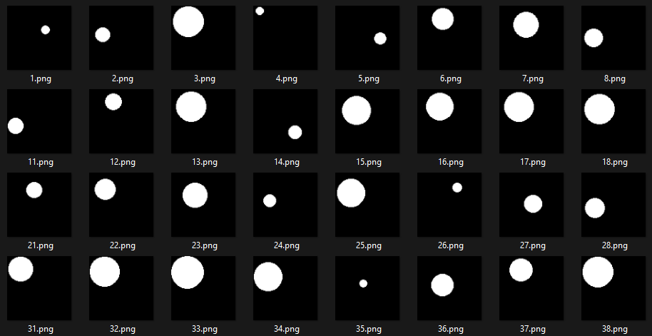
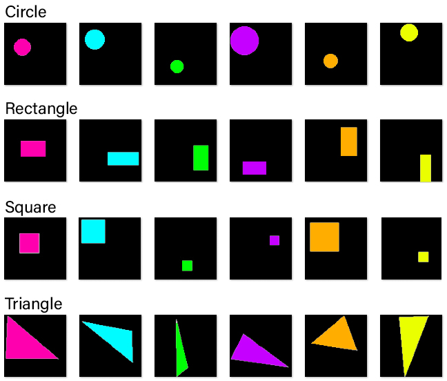

# ShapesDataset
Datasets or Machine Learning Data can be considered similar to data collections to carry out researches. The more comprehensive your data samples, the more valid your results will be. Having access to a comprehensive data sample will increase the validity of research results. Although now a day many datasets are available to use in the machine learning process, newbies and beginners may get confused in identifying and choosing the appropriate dataset for their projects. We are going to create and provide a broad and simple dataset for you to start practicing machine learning or even test your designed models. Moreover, you can simply adjust class and sample count, stroke color, and shape fill and even size of the samples. Eventually you can use this dataset to Shape/Image Classification, Object Detection and Object Recognition and etc.


You can run it simply by just "python app.py {countOfClass} {countOfSamples} {samplesColorType} {samplesWidth* samplesHeight}" where samplesColorType can include binary, etc.
## To run code do like this:
```
python app.py 3 500 binary 100*100 
```

## Result can be like this:


## Generated Shapes
You can see some of generated shapes in bellow:
### Circle

### Rectangular

### Square

### Colorful Dataset Samples
